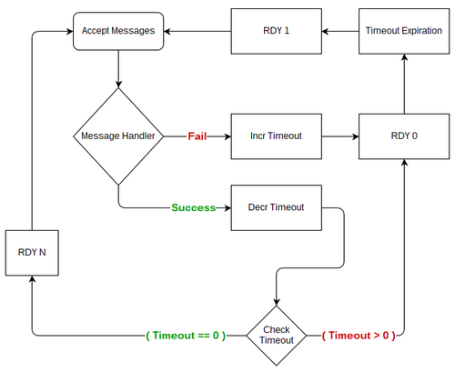

建立客户端库
===============
NSQ的设计，为了集群的鲁棒性和性能，把很多责任推到客户端。

本指南，试图指出客户端库需要履行的各种职责。发布消息给NSQ是非常简单的。所以下面重点关注消费者的行为。

通过本指南，我们希望能为NSQ用户提供实现跨语言的一致性的基础功能。

配置
-----------
我们的配置理念是设计系统能够灵活地支持不同的工作负荷。

消费者在一个TCP连接上订阅了1个主题 (topic)。在一个连接上你只能订阅一个主题。多个主题消费者需要相应的的数据结构。

使用nsqlookupd寻找， 对应客户端库，是可选的功能。客户端应该支持连接到一个或多个NSQD，支持轮询一个或者多个nsqlookupd。
当一个consumer被配置去轮询nsqlookup，轮询时间同样可以配置的。此外，典型的NSQ部署情况，即多个生产者和消费者在分布式环境中。
客户端每次轮询时间应该加一个额外的抖动时间差，这将有助于避免同事一群连接发出的请求对服务器造成的压力。

消费者的一个重要的性能按钮是可以在NSQD上调整它可以响应接收消息的数量。
这种流水线机制有助于缓冲，批量，异步处理消息. 按照约定，这个参数是max_in_flight,
它会影响RDY state如何管理。详见RDY State.

作为一个系统，被设计为优雅地处理故障，客户端库被期望实现, 重新处理失败的消息, 和提供每个消息的尝试次数。 详见消息处理。

与此相关的是，当消息处理失败，客户端库将自动处理 **re-queueing** 消息。NSQ支持 **REQ** 命令延迟。
客户端库将提供选项，这个延迟应设置为初始（第一次故障）和它如何改变在随后的失败。详见退避技术。

最重要的是，客户端库应该支持一些消息处理回调函数的配置方法。这些回调函数应该是简单的，通常接受一个参数（一个消息对象）。

发现
-------------
**NSQ** 的一个重要组件是 **nsqlookupd**, 它为消费者提供, 一个给定的 **topic** ，在运行时发对应的 **nsqd**.

虽然是可选地，但使用 **nsqlookupd** 大大减少针对大型分布式 **NSQ** 群集配置的数量。

当消费者是用 **nsqlookupd**, 客户端库应该负责下面的过程, 轮询所有的 **nsqlookupd** 更新 **nsqd** 清单, 维护 **nsqd** 连接.

查询一个 **nsqlookupd** 很简单. 只需要一个HTTP请求。例如::

    /lookup?topic=clicks

    返回的格式是json
    {
        "status_code": 200,
        "status_txt": "OK",
        "data": {
            "channels": ["archive", "science", "metrics"],
            "producers": [
                {
                    "broadcast_address": "clicksapi01.routable.domain.net",
                    "hostname": "clicksapi01.domain.net",
                    "tcp_port": 4150,
                    "http_port": 4151,
                    "version": "0.2.18"
                },
                {
                    "broadcast_address": "clicksapi02.routable.domain.net",
                    "hostname": "clicksapi02.domain.net",
                    "tcp_port": 4150,
                    "http_port": 4151,
                    "version": "0.2.18"
                }
            ]
        }
    }

**broadcast_address** 和 **tcp_port** 用来连接到一个 **nsqd** . 因为，设计上， **nsqlookupd** 不共享数据。
客户端库应该会合并来自所有 **nsqlookupd** 查询结果，建立 **nsqd** 最终列表。

一个周期定时器应该用来反复轮询配置的 **nsqlookupd**,  使消费者可以自动发现新 **nsqd** 。 客户端库应该自动连接新发现的 **nsqd** 。

连接处理函数
---------------
一旦消费者需要连接 **nsqd**, 它将打开一个TCP连接， 地址为 **broadcast_address:port**. 对于每个 **nsq** 每个 **topic**, 都需要一个单独
的TCP连接.

当连接到一个 **nsqd** 实例， 客户端库需要发送下面的数据

#. magic标示
#. **IDENTIFY** 命令
#. **SUB** 命令
#. **RDY** 初始计数为1

重连
-----------
客户端应该支持自动重连

* 如果消费者被配置连接一个具体的 **nsqd** 列表，重连的延迟时间应该按照退避算法的方式，即8s, 16s, 32s，直达最大值.
* 如果消费者被配置，通过 **nsqlookup** ， 发现 **nsqd** , 会自动重连基于轮询时间，即如果消费者和 **nsqd** 连接断开，
  只有在该 **nsqd** 在随后的 **nsqlookupd** 的轮询中被发现，客户端才会尝试重连。这使得消费者可以知道哪些 **nsqd**
  加入网络拓扑，哪些被删除。

特征协商
----------
**IDENTIFY** 命令用来在 **nsqd** 上设置元数据，修改客户端配置，和协商特征(feature_negotiation)。它满足2个需要

* 在某些情况下，客户想修改它如何和 **nsqd** 交互（如修改客户端的心跳间隔和启用压缩，TLS，输出缓冲等)。
  请参考 :ref:`tcp-protocol`
* **nsqd** 对 **IDENTIFY** 命令，返回一个json, 包括重要的服务器配置的命令

连接后，根据用户的配置，一个客户端库应当发送 **IDENTIFY** 命令，它的主体是一个JSON有效载荷::

    {
        "client_id": "metrics_increment",
        "hostname": "app01.bitly.net",
        "heartbeat_interval": 30000,
        "feature_negotiation": true
    }

**feature_negotiation** 表明，客户端可以接受一个返回的json. **client_id** 和 **hostname** 是任意的
文本，被 **nsqd** 用来识别客户端。 **heartbeat_interval** 用来设置客户端上的心跳间隔。

如果 **nsqd** 不支持 **feature_negotiation**, 就返回 **OK** 。否则返回::

    {
        "max_rdy_count": 2500,
        "version": "0.2.20-alpha"
    }

**max_rdy_count** 具体见 RDY State.

数据流和心跳包
---------------
一旦消费者在订阅的状态， **nsqd** 协议中的数据流应该是异步的. 对于消费者来说，
这意味着为了打造真正强大和高性能的客户端库, 应采用异步IO多路复用或线程（操作系统级和用户级线程）。

此外，客户将响应从 **nsqd** 发出的周期性心跳。默认情况下，时间间隔为30秒。客户端可以响应任何命令。
按照惯例，最简单的方法就是回答一个 **NOP** 。 细节参考 :ref:`tcp-protocol` 。

一个线程被用来从TCP流读取数据，解包，路由到对应的逻辑。它也负责处理心跳包。在底层，包括下面步骤

* 读取4字节, 解析为size
* 读取size个字节数据
* 解包数据
* 其他步骤
* 回到第一步，循环这个过程

简短的插曲，错误
------------------
由于异步性，它需要一点额外的状态跟踪, 为了联系起协议上的错误和产生它的命令字。
相反，我们采取了“快速失败”的方式，协议级的错误处理绝大多数都是致命的。
这意味着，如果客户端发送一个无效的命令, 被连接的 **nsqd** 为了保护自己, 强行关闭连接（如果可能的话，发送一个错误信息到客户端）。
这，再加上上面提到的连接处理函数，构成了一个更强大和稳定的系统。

不是致命的错误：

* E_FIN_FAILED,  **FIN** 命令，一个无效的消息id
* E_REQ_FAILED,  **REQ** 命令，一个无效的消息id
* E_TOUCH_FAILED, **TOUCH** 命令， 一个无效的消息id

因为这些错误时最常见的时序问题。他们不被认为是致命的。
这种情况通常发生在, 当一个消息在 **nsqd** 超时，重新排队, 和传递到另一个消费者。
原先的收件人已不再允许对消息的回应。

消息处理函数
------------------
当IO循环，从一个数据帧解包一个消息，它应该路由消息到配置的消息处理函数。

**nsqd** 期望在它配置的超时时间前收到答复 （默认60秒）。 有几个可能的场景：

* 当消息处理成功
* 消息处理失败
* 还需要更多的时间来处理消息
* 传送超时， **nsqd** 自动重新进入队列

在前3种情况下，客户端库将发生相应的命令. ( **FIN**, **REQ**, 和 **TOUCH** )

**FIN** 是其中最简单的，它告诉 **nsqd**, 可以安全地丢弃消息。 **FIN** 同样被用来你不想再处理或重试的消息。

**REQ** 告诉 **nsqd**, 消息应该重新排队(可选参数指定将要额外的尝试的时间) 。如果消费者没有指定可选的参数。
客户端库应该自动计算出这个参数。 客户端库应该丢弃超过最大尝试时间的消息。当这种情况发生，用户提供的回调函数
应该被执行。

如果消息处理函数需要更多的时间， 比配置中的超时时间还要多。 **TOUCH** 命令可用于重置在 **nsqd** 侧定时器。
这个指令可以重复， 直到消息是 **FIN** 或者 **REQ** 。客户端库不应该能够自动发送 **TOUCH** 。

如果 **nsqd** 发送消息后没有收到响应。 该消息会自动重新排队，将会传给下一个可用的消费者。

最后，每个消息带有一个属性：尝试的次数。客户端应该比较这个值，如果超过配置的最大值，就会丢弃这个消息。
当一个消息被丢弃时，一个回调函数被执行。
这个回调函数的典型的默认实现可能包括写入到磁盘上，打印日志等。用户应该能够覆盖默认的处理。

RDY状态
----------------
因为消息被 **nsqd** 推送给消费者。 我们需要一种方法来管理用户态的数据， 而不能依赖TCP的语义。
一个消费者的 **RDY** 状态就是 **NSQ** 流量控制机制。

在上面的配置章节提到， **max_in_flight** 配置选项。 这是一个并发性的性能按钮。 例如，
更大的 **max_in_flight**, 下游系统能够更多的批处理消息。

当一个消费者连接到 **nsqd**, **RDY** 值为0. 表示还没有消息交付。

客户端库有下面的责任：

#. 均匀分布 **max_in_flight** 到所有的连接
#. 决不允许所有连接的 **RDY** 总和（total_rdy_count）, 超过所设定的 **max_in_flight** 。
#. 每个连接不能超过 **nsqd** 配置 **max_rdy_count** 。
#. 公开的API方法，提示消息流的饥饿

引导和分布式
^^^^^^^^^^^^^
当选择合适的 **RDY** 时，有几个因素需要考虑， 为了均匀分布 **max_in_flight**.

* TCP连接应该是动态的， 有时提前不知道， 例如， 使用 **nsqlookupd** 发现 **nsqd** 。
* **max_in_flight** 可能小于连接数

启动消息流的客户端库需要发送一个初始RDY计数。

此外，在每个处理消息，客户端库应评估是否需要更新 **RDY** 状态。
如果当前值为0或者低于25%, 应该触发更新。

客户端库都应该均匀分布 **RDY计数** 到所有连接。通常，是 max_in_flight/num_conns 。

然而，当max_in_flight < num_conns, 无法采用上面的方式。
在这种情况下，客户端库应该评估 **nsqd** 活跃度：通过测量最近一次收到消息的时间间隔。
在配置的超时时间后， 需要重新分配 **RDY** 计数到一个新的 **nsqd** 。
通过这样做， 可以保证你找到有消息的 **nsqd** 。

保持 max_in_flight
^^^^^^^^^^^^^^^^^^^^^^^
客户端库应保证，指定的消费者，传送的消息数量， 最多不超过上限。
具体地说，每个连接的 **RDY** 的计数的总和不应超过配置的 **max_in_flight** 。

下面的例子在Python代码来确定该 **RDY** 计数是有效的： ::

    def send_ready(reader, conn, count):
        if (reader.total_ready_count + count) > reader.max_in_flight:
            return

        conn.send_ready(count)
        conn.rdy_count = count
        reader.total_ready_count += count

nsqd 最大的RDY计数
^^^^^^^^^^^^^^^^^^^^^
每个 **nsqd** 配置了一个参数 **max-rdy-count**, 如果消费者发出的 **RDY** 计数，超出了可接受的范围，
这个连接就会关闭。

消息流饥饿
^^^^^^^^^^^^^
最后，客户端应该提供一个API， 用来提示消息流饥饿。 只是简单比较 the number of messages they have in-flight vs. their configured max_in_flight,
这对消费者来说是不够的。这里面有2个问题

* 当消费者配置 **max_in_flight > 1**, 如果 **max_in_flight** 不能被 **num_connns** 整除。因为约定，不能超过 **max_in_flight**
  最终的请求，所有的 **RDY** 的总和会小于 **max_in_flight** 。
* 如果只有子集 **nsqd** 拥有消息。因为期待 **RDY** 分别平均，所有的 **RDY** 的总和会小于 **max_in_flight**

在这两张情况下，消费者将不会收到max_in_flight 个消息。
因此，客户端库应该暴露方法is_starved，用来评估连接是否饥饿，如下： ::

    def is_starved(conns):
        for c in conns:
            # the constant 0.85 is designed to *anticipate* starvation rather than wait for it
            if c.in_flight > 0 and c.in_flight >= (c.last_ready * 0.85):
                return True
        return False

退避算法
^^^^^^^^^^^^
当消息处理失败，接下去应该做什么， 是个很复杂的问题。 一方面，客户端应该需要额外的时间重新处理失败的消息,
一方面，系统应该尽可能高的吞吐量。 这两个对系统的稳定性来说，都是重要的。

通过减慢处理速度，称为退避，消费者允许下游系统从瞬态故障恢复。
然而，这种行为应该可配置的。因为它不一定是需要的，例如在低延迟的环境。

退避的实现，应该是通过发送 **RDY** 为0到对应的 **nsqd**, 通知它停止消息下发。持续保持在这个状态的时间，
应根据反复失败进行计算. 同样，成功处理消息会减少这个退避时间。

当消费者在退避状态，时间到期后，客户端库应该只发送 **RDY** 为1，无论 **max_in_flight** 是什么。
从“试水”重新回到之前的“全油门”。此外，退避超时期间，客户端库应该忽略任何的成功或失败，
（即，它应该只考虑每个退避超时的结果）

加密和压缩
^^^^^^^^^^^^^
**NSQ** 支持加密和压缩的特性。 加密算法使用TLS. 压缩算法是Snappy或DEFLATE。
Snappy需要第三方库。大多数的语言都原生支持DEFLATE。

当收到 **IDENTIFY** 应答包， 可能如下 ::

    {
        "deflate": false,
        "deflate_level": 0,
        "max_deflate_level": 6,
        "max_msg_timeout": 900000,
        "max_rdy_count": 2500,
        "msg_timeout": 60000,
        "sample_rate": 0,
        "snappy": true,
        "tls_v1": true,
        "version": "0.2.28"
    }

tls_v1设置为true, 表明服务器支持TLS。 在任何的数据传输前，需要进行TLS握手。
在成功的TLS握手后，你会收到一个加密后的 **OK** 回复。

类似地，如果启用了压缩。传输的数据都会被压缩。 snappy 和 DEFLATE只能选择一个。

总结
^^^^^^^^^^^^
分布式系统非常有趣。

**NSQ** 集群中各个组件互相作用，最终建立起一个强大的，高性能, 稳定的平台。
我们希望本指南能够揭示客户端库的重要性。

去实现其他语言的库，建议你们使用pynsq和go-nsq作为参考。
pynsq可以分为3个核心组件：

* Message - 高级消息对象， 和 **nsqd** 通信的各种命令字 (FIN, REQ, TOUCH等)。
* Connection - 更高层次的TCP的封装
* Consumer  - 消费者, 与用户交互的前端，它负责发现主题，创建连接，管理就绪状态，解析原始数据，创建消息对象，消息处理程序。
* Producer - 生产者，与用户交互的前端，负责发布消息.

我们很高兴能够帮助任何人建立他们的客户端库。我们也期待其他的志愿者能够改善我们的代码。
我们的社区现在也已经有很多开源的客户端库。
