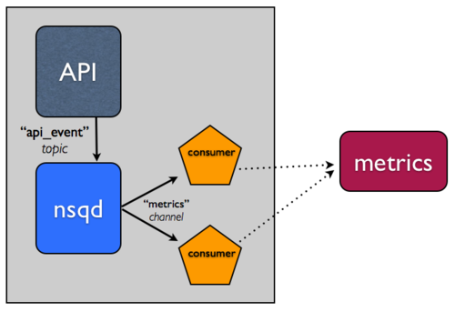
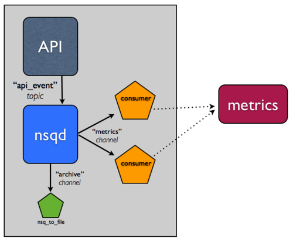
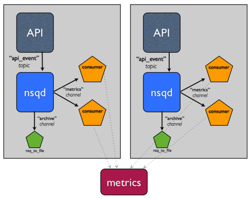
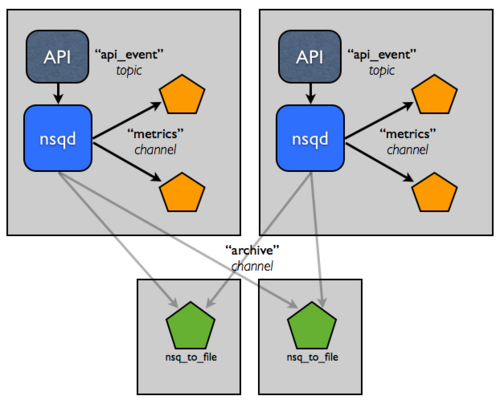
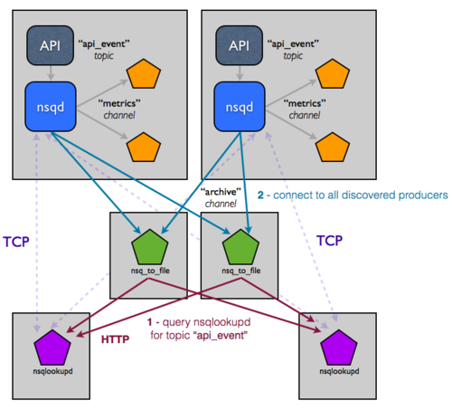

网络拓扑模式
===============
本文档描述了一些常见的拓扑模式，用来解决各种常见的问题。

数据收集
----------
无论你构建什么类型的Web服务，在大多数情况下，你会想收集一些数据来了解你的基础架构，你的用户，你的产品。

一个Web服务，通常这些数据是通过HTTP请求产生的事件，就像一个API。
单纯的方法这是同步的，通过API请求直接写你的数据采集系统。

.. image:: ../images/naive.png

考虑下面的问题

* 如果你的数据采集系统停机了， 会发生什么
* 如果你的API请求挂起或失败
* 针对不断增加的API请求量的要求，你应该如何保证数据采集系统的水平扩展？

来解决所有这些问题的其中一个方式都是异步地访问你的数据采集系统。也就是说，将数据放进某种本地队列,
如何再通过一些其他进程写进你的下游系统。 这种分离，使系统的鲁棒性和容错性更好。在Bitly，我们用 **NSQ** 来实现。

简介: **NSQ** 有topic和channel的概念。具体见设计部分。

下面是图示：

整合 **NSQ** 非常简单，下面用简单的案例来说明

#. 在同一台主机上运行nsqd进程和你的应用进程
#. 更新你的应用程序，写events到nsqd, 而不是直接访问数据采集系统。这样可以更容易检查和维护事件流。
   我们一般使用JSON格式的数据。这样就可以直接通过/put直接提交HTTP POST请求到nsqd.
#. 选择你最喜欢的语言，使用我们的对应的客户端库。 应用进程将要提交这些事件的数据。

下面是1个使用Python客户端库的例子 ::

   import nsq
   import json

    def metrics_write(message):
        json_data = json.loads(message)

        # iterate over the metrics you want to record and write
        # into your downstream metrics system

        if any_metrics_failed:
            # this will indicate to pynsq that it should re-queue
            # the message for you
            return False

        return True

    tasks = {"metrics_write": metrics_write}
    r = nsq.Reader(tasks, nsqd_tcp_addresses=['127.0.0.1:4150'],
            topic="api_requests", channel="metrics")
    nsq.run()

通过使用我们的官方的客户端库, 消费者和生产者可以解耦; 当消息处理失败时，消息者还可以优雅降级处理。
我们的库有两个关键的功能，有助于此：

#. 重试-当你的消息处理程序失败， **REQ** 被发送到nsqd。同时，如果nsqd会在1个配置的时间窗口内没有收到客户端的响应，就会自动超时，重新排队消息。这两个方面保证了消息传送的可靠性。
#. 指数退避算法。

这2个特性帮助系统允许系统从容地应对下游故障。

持久性
--------------
如果你的数据采集系统不可用，你必须保证没有数据丢失和同样提供API服务。
你也可以通过增加消费者进程的个数，从而水平扩展你系统的处理能力。

但是，如果你想要特定的API的事件消息，很难提前就能预测到。

提前备份这些数据流的日志是一个好的办法。 Logs tend to be relatively easy to redundantly backup,
making it a “plan z” of sorts in the event of catastrophic downstream data loss.
But, would you want this same consumer to also have the responsibility of archiving the message data?
Probably not, because of that whole “separation of concerns” thing.

备份一个 **NSQ** 主题非常常见，我们提供了一个程序 **nsq_to_file**.

记住：在 **NSQ**, 每个topic的每个channel是独立的，可以收到这个topic的所有消息。 你可以利用这个特性，备份流。
实际中，你的数据收集系统如果有问题，不会影响到消息的备份，持久化到硬盘中。

使用 **nsq_to_file** 如下 ::

    /usr/local/bin/nsq_to_file --nsqd-tcp-address=127.0.0.1:4150 --topic=api_requests --channel=archive

分布式系统
-----------------
如果你发现你的系统不能通过增加机器，进行扩展。这就是一个明显的单点故障。

不幸的是，建立一个分布式系统是困难的。幸运的是， **NSQ** 可以帮助你。
**NSQ** 的设计有助于实现高可用性和容错性的分布式系统。
假设一个事件流是非常重要的。即使主机发生故障，你希望信息至少能够存档，所以你添加另一个主机。

如果你有两台主机，在这2台主机前, 有负载均衡的机制。就不会有单点故障的问题。

现在，持久化，压缩，传输这些日志对性能明显有影响。 如果能够把这些任务分割给拥有更好的IO能力的主机。

这种拓扑结构和配置，可以很容易地扩展到两位数的主机。但是你还是需要手动管理这些服务上的配置。
具体来说，在每一个消费者进程上，硬编码设置nsqd的地址在哪里，是一种痛苦。
你想要的是，基于nsq集群， 配置信息可以动态地自动变化和访问. 这就是nsqlookupd目的。

nsqlookupd是一个守护进程，记录和传播运行时的NSQ集群状态。NSQD实例保持持久的TCP连接,  推状态变化信息给nsqlookupd。
具体而言，一个nsqd注册本身作为对于一个特定的topic的一个生产者。
这允许消费者通知查询nsqlookupd, 确定谁是那个topic的生产者，而不是硬编码，配置。
随着时间的推移，他们将了解有关新的生产者的存在, 能够绕过故障。

你需要做的唯一的变化是指定你现有的nsqd和消费者进程连接到nsqlookup. 每个进程都知道nsqlookupd, 但消费者不知道生产者，
反之亦然。 拓扑现在看起来像这样:

乍一看这可能更复杂。 但实际上不是这样的。因为这对不断增长的基础设施很难直观显示。
通过nsqlookup作为naming server, 你已经有效地解耦生产者与消费者。添加依赖于特定的流的额外的下游服务是微不足道的。
只需要指定你关心的topic, nsqlookupd就会帮你查询到这些生产者。
