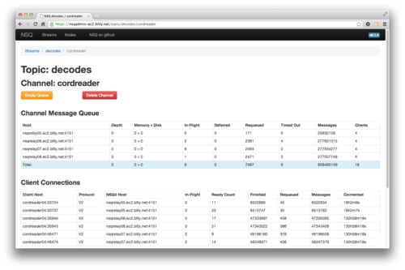
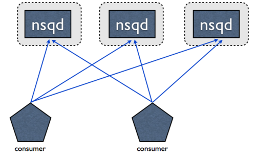
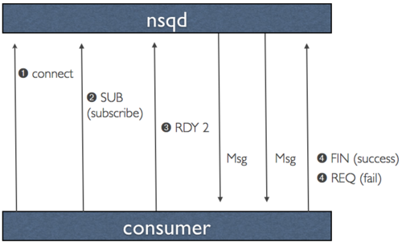

设计
============
NSQ是继承于 `simplequeue`_ (part of `simplehttp`)。 因此被设计为:

.. _simplequeue: https://github.com/bitly/simplehttp/tree/master/simplequeue
.. _simplehttp: https://github.com/bitly/simplehttp

* 提供更简单的拓扑方案，达到高可性和消除单点故障
* 满足更强的消息可靠传递的保证
* 限制单个进程的内存占用（通过持久化一些消息到硬盘上）
* 极大简化了生产者和消费者的配置要求
* 提供了一个简单的升级路径
* 提升效率

简化配置和管理
------------------
单个nsqd实例被设计成可以同时处理多个数据流。流被称为topics,
topics有1个或多个channel。每个channel都接收到一个topic中所有消息的拷贝。在实践中，一个channel映射到下行服务消费一个topic。

topic, channel都不需要预先配置。topic由第一次发布消息或第一次订阅来创建。 channel第一次订阅的时候创建。

topic和channel的所有缓冲的数据相互独立，防止缓慢消费者造成对其他channel的影响（同样适用于topic级别）。

1个channel一般会有多个客户端连接。假设所有已连接的客户端处于准备接收消息的状态，每个消息将被传递到一个随机的客户端。

例如：

#.. image:: ../images/nsqd.gif

NSQ还包括一个辅助应用程序, nsqlookupd，它提供了一个目录服务，消费者可以查找到提供他们感兴趣订阅topic的nsqd地址。
在配置方面，把消费者与生产者解耦开（它们都分别只需要知道哪里去连接nsqlookupd的共同实例，而不是对方），降低复杂性和简化维护。

在更底的层面，每个nsqd有一个与nsqlookupd的长期TCP连接，定期push其状态。
这个数据被nsqlookupd用于给消费者通知nsqd地址。对于消费者来说，一个暴露的HTTP /lookup 接口用于轮询。

为topic引入一个新的消费者，只需启动一个配置了nsqlookup实例地址的NSQ客户端。
无需为添加任何新的消费者或生产者更改配置，大大降低了开销和复杂性。

.. warning::

    在将来的版本中，启发式nsqlookupd可以基于深度，已连接的客户端数量，或其他“智能”策略来返回地址。
    当前的实现是简单的返回所有地址。最终的目标是要确保所有深度接近零的生产者被读取。

值得注意的是，重要的是nsqd和nsqlookupd守护进程被设计成独立运行，没有相互之间的沟通或协调。

我们还认为重要的是有一个方式来聚合查看，监测，并管理集群。我们建立nsqadmin做到这一点。
它提供了一个Web UI来浏览topic/channels/consumers和深度检查等每一层的关键统计数据。
此外，它还支持几个管理命令, 例如移除channel, 清空channel。

简单的升级路径
-----------------
这是我们的高优先级之一。我们的生产系统处理大量的流量，都建立在我们现有的消息工具上，
所以我们需要一种方法来慢慢地，有条不紊地升级我们特定部分的基础设施，而不产生任何影响。

首先，在消息生产者方面，我们建立nsqd匹配simplequeue。具体来说，nsqd暴露了一个HTTP /PUT端点，就像simplequeue，
上传二进制数据（需要注意的一点是endpoint需要一个额外的查询参数来指定topic）。
想切换到发布消息到nsqd的服务只需要很少的代码变更。

第二，我们建立了兼容已有库功能和语义的Python和Go库。这使得消息的消费者只需要修改很少的代码。所有的业务逻辑保持不变。

最后，我们建立工具连接起新旧组件。这些都在仓库的示例目录中：

::
    1. nsq_pubsub -在NSQ集群中以HTTP接口的形式暴露的一个pubsub
    2. nsq_to_file - 将一个给定topic的所有消息持久化到文件
    3. nsq_to_http -对一个topic的所有消息的执行HTTP请求到（多个）endpoints

Eliminating SPOFs
-------------------
NSQ被设计以分布的方式被使用。nsqd客户端（通过TCP）连接到指定topic的所有生产者实例。
没有中间人，没有消息代理，也没有单点故障。

这种拓扑结构消除单链，聚合，反馈。 相反，你的消费者直接访问所有所有生产者。
从技术上讲，并不关心哪个客户端连接到哪个NSQ产，只要有足够的消费者连接到所有生产者，保证了所有的消息最终将被处理。

对于nsqlookupd，高可用性是通过运行多个实例来实现。他们不直接相互通信和数据被认为是最终一致。
消费者轮询所有的配置的nsqlookupd实例和合并response。失败的，无法访问的，或以其他方式故障的节点不会让系统陷于停顿。

消息传递保证
--------------
NSQ保证消息将交付至少一次，虽然重复的消息是可能的。消费者应该关注到这一点，删除重复数据或执行幂等操作。

这个担保是作为协议和工作流的一部分，工作原理如下（假设客户端成功连接并订阅一个topic）：

#. 客户表示他们已经准备好接收消息
#. NSQ发送一条消息，并暂时将数据存储在本地（在re-queue或timeout）
#. 客户端回复FIN（结束）或REQ（重新排队）分别指示成功或失败。
   如果客户端没有回复,NSQ会在设定的时间超时，自动重新排队消息。

这确保了消息丢失唯一可能的情况是不正常结nsqd进程。在这种情况下，这是在内存中的任何信息（或任何缓冲未刷新到磁盘）都将丢失。

如何防止消息丢失是最重要的，即使是这个意外情况可以得到缓解。
一种解决方案是构成冗余nsqd对（在不同的主机上）接收消息的相同部分的副本。
因为你实现的消费者是幂等的，以两倍时间处理这些消息不会对下游造成影响，并使得系统能够承受任何单一节点故障而不会丢失信息。

附加的是 NSQ 提供构建基础以支持多种生产用例和持久化的可配置性。

限制内存占用
--------------
nsqd提供一个mem-queue-size配置选项，这将决定一个队列保存在内存中的消息数量。
如果队列深度超过此阈值，消息将透明地写入磁盘。 nsqd 进程的内存占用被限定于 mem-queue-size * #_of_channels_and_topics。

此外，一个精明的观察者可能会发现，这是一个方便的方式来获得更高的传递保证：把这个值设置的比较低（如1或甚至是0）。
不正常重启的情况下，磁盘支持的队列仍然能够正常工作（虽然消息可能被传递两次）。

此外，正常关机(通过给nsqd进程发送TERM信号)会持久化所有的消息, in memory, in-flight, deferred, and in various internal buffers.

请注意，一个名称以#ephemeral结束的channel不会在超过 mem-queue-size之后刷新到硬盘。
这些临时channel 将在最后一个客户端断开连接后消失。

效率
---------
NSQ被设计成一个使用简单 size-prefixed 为前缀的，与“memcached-like”类似的命令协议。
所有的消息数据被保持在核心中，包括像尝试次数、时间截等元数据类。
这消除了数据从服务器到客户端来回拷贝，当重新排队消息时先前工具链的固有属性。
这也简化了客户端，因为他们不再需要负责维护消息的状态。

此外，通过降低配置的复杂性，安装和开发的时间大大缩短（尤其是在有超过 > 1 消费者的topic）。

对于数据的协议，我们做了一个重要的设计决策，通过推送数据到客户端最大限度地提高性能和吞吐量的，而不是等待客户端拉数据。
这个概念，我们称之为RDY状态，基本上是客户端流量控制的一种形式。

当客户端连接到nsqd和并订阅到一个channel时，它被放置在一个RDY为0状态。 这意味着，还没有信息被发送到客户端。
当客户端已准备好接收消息发送，更新它的命令RDY状态到它准备处理的数量，比如100。
无需任何额外的指令，当100条消息可用时，将被传递到客户端（服务器端为那个客户端每次递减RDY计数）。

客户端库的被设计成在RDY count达到配置max-in-flight的25%发送一个命令来更新RDY计数。
并适当考虑连接到多个nsqd情况下，适当地分配。

这是一个重要的性能控制，使一些下游系统能够更轻松地批量处理信息，并从更高的max-in-flight中受益。

值得注意的是，因为它既是基于缓冲和push方式来满足需要流(channel)的独立副本的能力，
我们已经提供了行为像simplequeue和 pubsub 相结合的守护进程。这是简化我们的系统拓扑结构的强大工具，
如上述讨论那样我们会维护传统的toolchain。

Go
---------
我们早早做了一个战略决策，利用Go来建立NSQ的核心。我们最近的博客上讲述我们在bitly如何使用Go，并提到这个适合的项目。
通过浏览那篇文章可能对理解我们如何重视这么语言有所帮助。

关于NSQ，Go-chan适合于的nsqd的内部工作。我们充分利用缓冲的Go-chan 来管理我们在内存中的消息队列和无缝把溢出消息放到硬盘。

利用标准库很容易地编写网络层和客户端代码。只需要付出很少的努力，就可以整合内存和CPU剖析进行优化。
我们还发现Go易于单独测试组件，模拟类型接口，以迭代方式构建功能。
