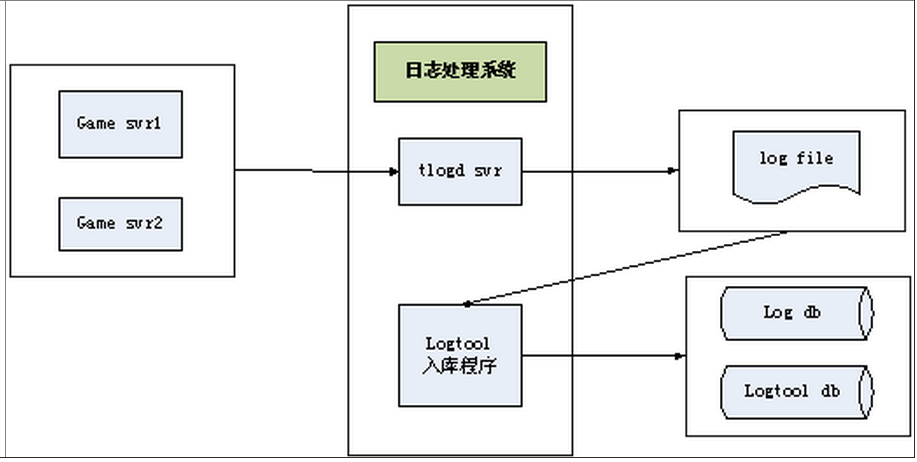
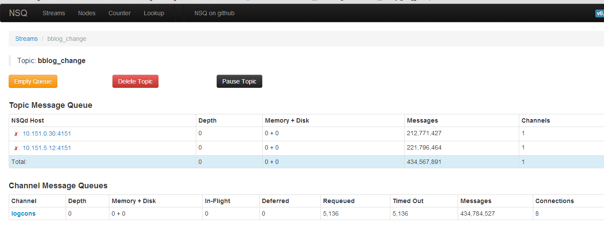
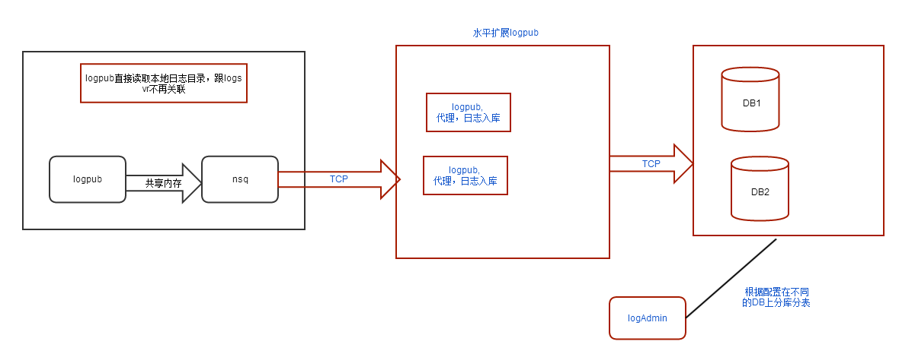

企鹅日志采集平台
===================
LogAgent是企鹅日志统一采集的平台。功能等同于TLog.

企鹅项目是非常老的系统。最早的日志采集， 是经分同事，在每台产生统计日志的机器上，
部署cron定时任务，执行对应的sh脚本，直接插入mysql实现的.

这套系统，维护，更新，操作都非常复杂。2012进行改造，这个任务被直接丢给企鹅项目组。

为什么企鹅没有采用TLog?
企鹅日志量非常大。单台mysql根本无法承载这个数据量。经分基于数据库的提取数据的script,
是分库分表的。 2012年TLog并不支持该功能，所有没有采用。

2012年改造版本
--------------
.. image:: images/logagent2012.png

上图是这个版本的框架图。涉及3个进程

* logsvr, 企鹅统一日志打印程序。负责把本机上各应用程序的日志写入磁盘中。负责把统计日志交给logagent
* logagent, 负责把日志分库，分表，分日期，插入到mysql
* logAdmin, 对mysql集群进行建表。删表操作。

企鹅的日志，因为查询性能和历史原因，没有使用mysql partition方式。而是按照日期进行分开。
例如t_login这张表。 现网上6台DB, 每个DB存在petLog_0 ~ petLog_99的数据库。
在每一个库里， 都会有t_login_20140903, t_login_20140904 ... 这些表。

应用程序无需修改
^^^^^^^^^^^^^^^^^^^^^
兼容logsvr和petLog. 应用程序如果使用petLog, 不需要进行任何修改。
petLog打印的日志， 举例如下

::

    2014-09-01 13:39:11.241519|bubblesvr(25080)|50003|121189457|0|121189457|bubble_proc.cpp(1274)||
    |bubble_proc.cpp:1274(ProcLogin)|bblog_login|0|1|6|1|10|0|0|0|

第3个字段，例如5003，表示日志id, 每一个日志id对应一种日志格式，对应数据库中的一个表。

::

    {
    "default_db_port": "3306",
    "default_db_db": "petLog_0",
    "route_list": [
        // logAdmin用这部分配置，进行分库分表
        {
            "uin_start": "0",
            "db_host": "127.0.0.1",
            "uin_end": "99"
        }
    ],
    "default_db_user": "petlog",
    "default_db_pw": "cGV0bG9nCg",
    "log_list": [
        {
            "logid": "5001",
            "db_db": "",
            "table": "t_login",
            "field_list": [
                {
                    // 数据库中表的字段名
                    "column": "date",
                    // 原始日志中第几个字段
                    "field_num": "1",
                    "type": "datetime"
                },
                {
                    "column": "uin",
                    "field_num": "4",
                    "type": "int unsigned"
                },
                {
                    "column": "ret",
                    "field_num": "10",
                    "type": "int"
                },
                {
                    "column": "version",
                    "field_num": "12",
                    "type": "int"
                },
                {
                    "column": "ip",
                    "field_num": "15",
                    "type": "varchar"
                },
                {
                    "column": "login_type",
                    "field_num": "17",
                    "type": "int"
                },
                {
                    "column": "level",
                    "field_num": "20",
                    "type": "int"
                },
                {
                    "column": "plat_id",
                    "field_num": "21",
                    "type": "int"
                },
                {
                    "column": "vip",
                    "field_num": "13",
                    "type": "varchar"
                }
            ]
        }
    ]
    }

这个json文件被logsvr, logagent, logadmin共同使用.

存在的问题
^^^^^^^^^^^^^^
现网运行1年后，存在下面的问题

* 企鹅的DB使用旧的机器。基本上0.5年就会坏掉一台机器上的磁盘。这种情况下，日志需要补录。
* 网络原因操作，机器原因造成的mysql无法正常入库。日志需要补录。却不能精确定位哪些日志是漏下的。
* 补录日志。一般做法是读取在原先的机器上log目录下的历史日志文件，重新插入到logagent的输入共享内存。
  这时候，如果日志量比较大。直接导致queue满出。补录还没有完成，又影响新的日志入库。
* 100多台机器连接db, 每次新的机器增加，都需要数据库授权。运维压力大。
* 现网的问题：db机器因为磁盘原因，每个insert操作需要几十秒，DBA没有任何收到任何告警。loaggent前的共享内存
  队列直接满出。大量日志没有正常入库。过1天之后，才发现这个问题。
* 没有统一监控。下面的问题无法解答：这台机器上产生了哪些表的日志？这台机器logagent还在正常工作吗？
  这张表是哪些机器产生的？...

针对上面的问题， 特别是遇到需要补录的情况，非常麻烦, 思考如何改进这个系统。

在改造前，学习了TLog的系统设计。

应用通过UDP传递日志给tlog. logtool是定时执行程序。存在限制：一小时内必须保证上个小时的日志完全入库。
TLog系统明显日志丢失，补录不正确的问题。

* http://km.oa.com/group/545/articles/show/190767?kmref=search
* http://km.oa.com/group/18176/articles/show/138413?kmref=search

2014, 新的开始
-------------------
改造后，新的系统基于NSQ组件， 有以下特性

#. Go语言实现, 部署简单
#. petLog兼容
#. 日志超过内存上限，日志将被透明地保存在磁盘上
#. 统一的管理工具, 集群实时监控
#. 水平扩展logpub, 可以控制mysql日志入库速率
#. 基本不再需要补录数据
#. 随便可以备份任何张表的原始日志
#. 性能指标。产生日志100多台机器。每天入库20亿条以上的日志。 延迟低于15分钟（可以配置）

nsq提供了以上2, 3的特性，具体可见 http://nsq.io/overview/features_and_guarantees.html

统一监控
-----------

上图就是监控页面。浏览器打开。 110表示当前有110台机器上产生日志。下面每一行，可以看见ip地址，以及
分别产生什么日志。 每台机上上nsqd，都可以进行性能采集。支持pprof的所有指标。

第2张图，可以知道这张表的日志情况。哪些机器产生？分别产生了多少条？当前保存中内存中有多少，磁盘上有多少？
timed out可以判断网络是否繁忙。

如果需要，还可以结合statsd, Graphite进行出图。如下面显示

.. image:: images/nsqadmin3.png

系统结构图
---------------

这里重点说说，这个系统如何避免日志补录的情况。
一般情况下，如果因为DB原因造成日志无法入库。logcons发现这种情况，会直接退出。
退出前，会把还没有内存中还没有入库的数据以sql语句的方式导出到文件。同时通过Agent发送短信，
RTX告警给管理员。运维监控工具，过段时间后尝试重新拉起logcons. logcons启动前会检查每个DB的能否正常连接，
如果不行，就启动不了。这样logcons也就不会从前端的nsqd读取日志。日志就不会在这里丢失。
如果logcons很长时间没有拉起，或者重启的期间，nsqd设置为100,000条日志上限，超过这个值，就会自动
写到磁盘上。一旦logcons恢复，拿走内存中的日志。磁盘上的日志也会自动重新进入内存中。

nsq, 透明写消息到磁盘， 可以参考: http://www.oschina.net/translate/day-22-a-journey-into-nsq

如果因为DB端日志入库速率过慢，logcons的内部实现的模型，通过unbuffered channel，会自动sleep前面读取日志的
线程。这个模型就可以根据后端的日志输出的速率，控制前端的输入速率。
